ENGSCI 255 Lab 1
================
Navindd Raj
Due Date: 5pm Monday 7 May 2018

Question 1
----------

#### Read in and inspect the data

``` r
titanic.df <- read.csv("titanic.csv",header=TRUE)

# inspect the different attributes of the data set given
attributes(titanic.df)$names
```

    ##  [1] "PassengerId" "Survived"    "Pclass"      "Name"        "Sex"        
    ##  [6] "Age"         "SibSp"       "Parch"       "Ticket"      "Fare"       
    ## [11] "Cabin"       "Embarked"    "X"           "X.1"         "X.2"        
    ## [16] "X.3"

``` r
# make "Survived" and "Pclass" into factors, as they are currently numerical
titanic.df = within(titanic.df, {SurvivedFactor = factor(Survived)})
titanic.df = within(titanic.df, {PclassFactor = factor(Pclass)})
```

Some interesting attributes to check out at first might be: "Pclass", "Sex", "Age", "Fare". Hopefully this gives us a vague idea of the various factors that affected the survival rate during the Titanic accident. All the plots will include the "Survival" attribute as a third dimension, shown by colour.

``` r
# Fare vs Age
p = qplot(Age, Fare, data=titanic.df, colour=SurvivedFactor, na.rm=TRUE) 
p + ggtitle("Fare vs Age for Titanic Passengers") + geom_point(alpha = 0.5, na.rm=TRUE) + ylim(0, 300)
```

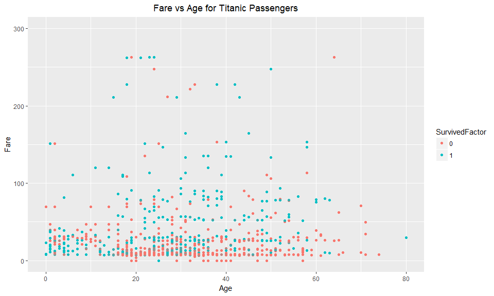

This plot looks pretty normal, with no visible significant trend in survival rate. However, we can see a region with high "red" density (corresponding to passengers that did not survive) in the Fare 0-25, Age 17-57 area on the plot. Let's see if we can find something that backs this up more later on. I shortened the y-axis to make the plot more readable in the lower regions, but there were 3 data points that were outside this range (paid a high fare of over 500). Their ages were between 30 and 40, and all three survived.

**For the next two plots below, please ignore the central line down each factor on the plot, not sure how to remove it but it's just the jittered data combined into one point.**

``` r
# Pclass vs Fare
# The three points that aren't in range were all class 1 and all survived
q = qplot(PclassFactor, Fare, data=titanic.df, colour=SurvivedFactor, na.rm=TRUE)
q + geom_jitter(alpha = 0.75, na.rm=TRUE) + ggtitle("Passenger Class vs Fare") + ylim(0, 300) 
```

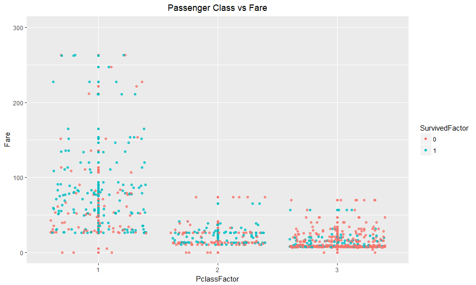

This plot gives a much stronger correlation to survival rates than the fare vs age plot. We can see the majority of passengers in Class 1 survived, while many from Class 2 survived as well, apart from the people at the very bottom with the lowest fare for Class 2. We can see in Class 3, the majority of passengers did not survive, especially so for those that paid the lowest fares. It is quite obvious here that Class 1 is the highest class. Class 2 and Class 3 have similar fare ranges but the survival rate of Class 3 is much lower than that of Class 2... perhaps the location of the cabins of those classes were different such that Class 3 had a lower survival rate? Again, 3 data points are missing, but they were all in Class 1 and all survived.

``` r
# Sex vs Age
r = qplot(Sex, Age, data=titanic.df, colour=SurvivedFactor)
r + geom_jitter(alpha = 0.75) + ggtitle("Sex vs Age")
```

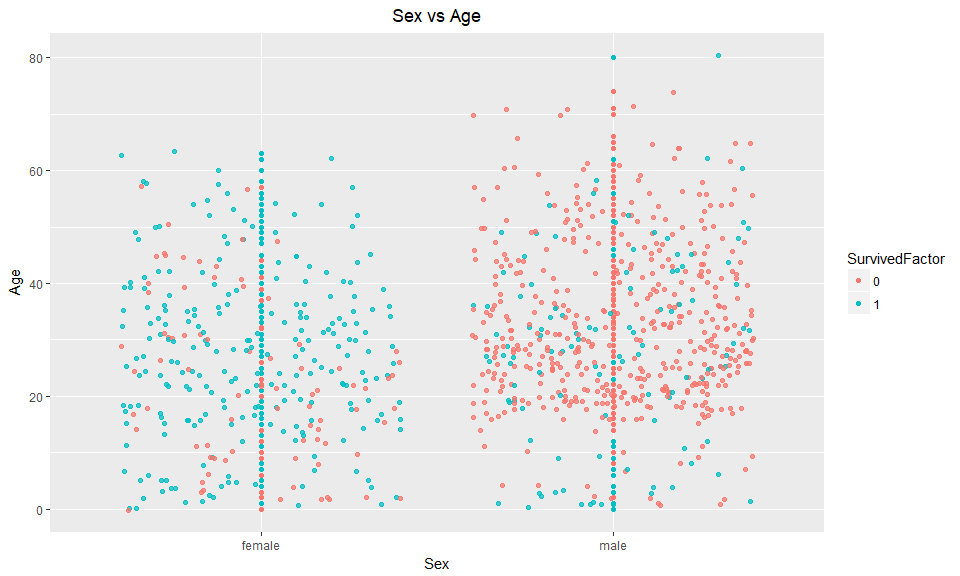

This is probably the most profound plot for this data set. We can see a clear correlation between the survival rate of males and females on the ship (women and children first). Nothing much can be said about young children under the age of 10, but looking at the under 10's of the males, it's safe to say there is a lower density of red there than the rest of the males.

------------------------------------------------------------------------

Question 2
----------

``` r
set.seed(99) # sets a seed for random number generator
```

#### a)

``` r
# perform a k-means clustering with 20 iterations, using only the "Age" and "Fare" attributes
titanicCluster = kmeans(titanic.df[c(6,10)], 2, nstart = 20, iter.max = 20)
```

Some information about the clustering:

``` r
titanicCluster$size    # size of each cluster
```

    ## [1]  53 838

As you can see, the clustering is very skewed (53 in one cluster, 838 members in the other cluster). How many people survived in the entire dataset?

``` r
survivors = 0
for (i in seq(1,length(titanic.df$Survived))) {
     if (titanic.df$Survived[i] == 1) {
         survivors = survivors + 1
     }
}
print(survivors)
```

    ## [1] 342

So there are 342 survivors, but only two clusters of 53 and 838. There will be a lot of overlap in the survivors/nonsurvivors in this particular clustering, and it is fairly inaccurate.

``` r
titanicCluster$centers    # means of each cluster
```

    ##        Age      Fare
    ## 1 31.35849 187.03286
    ## 2 29.77566  22.41194

Looking at the cluster means, the ages do not vary too much but the fare paid by cluster 1 is much higher than that of cluster 2.

Let's look at a table to see who survived/didn't survive in each cluster:

``` r
# columns are survived/not survived, rows are the two clusters created
table(titanicCluster$cluster, titanic.df$SurvivedFactor)
```

    ##    
    ##       0   1
    ##   1  14  39
    ##   2 535 303

It seems the clustering didn't work too well to differentiate between who survived or not...

The rate of survival in cluster 1 is 39/(39 + 14)=73.6%

The rate of survival in cluster 2 is 303/(303 + 535)=36.2%

#### b)

Blue for survivors, red for nonsurvivors:

``` r
# scatter plot of the two clusters in Age vs Fare attributes
titanicCluster$cluster <- as.factor(titanicCluster$cluster)
p = qplot(Age, Fare, data=titanic.df, colour = titanicCluster$cluster, na.rm = TRUE)
p + ggtitle("Fare vs Age for Titanic Passengers", subtitle = "with clustering using 'Age' and 'Fare'") + ylim(0, 300) + theme(legend.position="none")
```

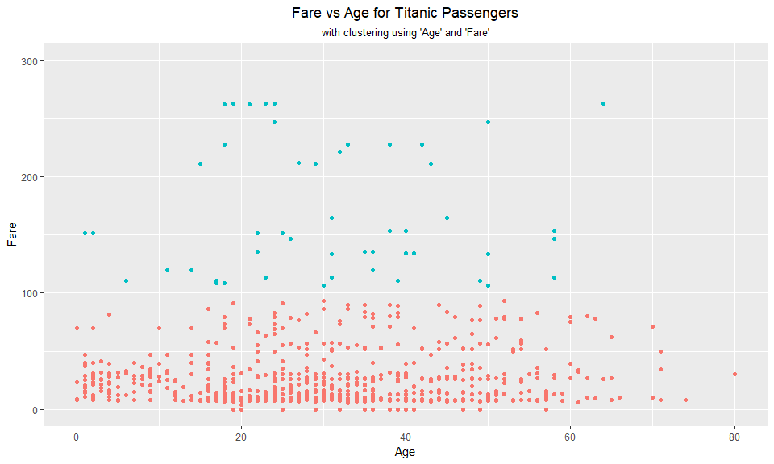

From the clustering algorithm and plot, we can see that cluster 1 has a significantly rate of survival than cluster 2. Through the plot, we can see that cluster 1 consists of people whos fare cost more than $100, and cluster 2 consists of people whos fare is less than $100, regardless of age. The conclusion drawn from this particular clustering is that people who had a higher fare had a higher chance of survival than those that paid a lesser fare. However, this clustering is fairly inaccurate, as there are 342 survivors in the dataset but only supposedly 53 in this clustering.

#### c)

It was established by the scatter plot that age does not matter for this particular clustering, and a fare of $20 would put the passenger in cluster 2. This means they have a 36.2% chance of survival, based solely on this clustering.

#### d)

I think attributes that would cluster survivors well are: the passenger class, age, sex, siblings/spouses, parents/children.

Lets try a clustering of 2 centres with pclass, age, sibsp, parch and sex, in hopes that our cluster will split survivors and nonsurvivors. If we want to cluster sex, which is non numeric attribute, we have to encode it, shown in the code below. One problem of comparing these attributes is, since we are comparing attributes like age which has a range from around 0 to 80, to other attributes like sex and pclass only have a range of 1-2 and 1-3, there is a large scale difference. One unit change in age is not too significant, but a one unit change in sex is literally life changing... To combat this, we can use the scale() function to properly scale our data before processing it.

``` r
# encode the "Sex" attribute and add it into the titanic dataframe
titanic.df = within(titanic.df, {Sex_encoded = as.numeric(as.factor(titanic.df$Sex))})

# perform a k-means clustering using "Pclass", "Age", "Sibsp", "Parch" and "Sex" (encoded) attributes
# with scaled values
# with 2 clusters and 20 iterations
titanicCluster2 = kmeans(scale(titanic.df[c(3,6,7,8,19)]), 2, nstart = 20, iter.max = 20)
```

Some information about the clustering:

``` r
titanicCluster2$size    # size of each cluster
```

    ## [1] 366 525

Looks like this time, the clustering is much better at representing who actually survived or not. Unforunately, we can't check the means of each cluster as the data was scaled before being clustered, so we can't unscale it like normal. We can still check the results on plots though.

``` r
# columns are survived/not survived, rows are the two clusters created
table(titanicCluster2$cluster, titanic.df$SurvivedFactor)
```

    ##    
    ##       0   1
    ##   1 114 252
    ##   2 435  90

This time, there looks to be a much better separation of survivors (compared to last clustering, in reference to our data).

The rate of survival in cluster 1 is 252/(252 + 114)=68.9%

The rate of survival in cluster 2 is 90/(90 + 435)=17.1%

Lets check the plots to see if our clustering was somewhat successful (code hidden because super messy). Again, red = not survived, blue = survived. Plots using clusters on the left, original data on the right:

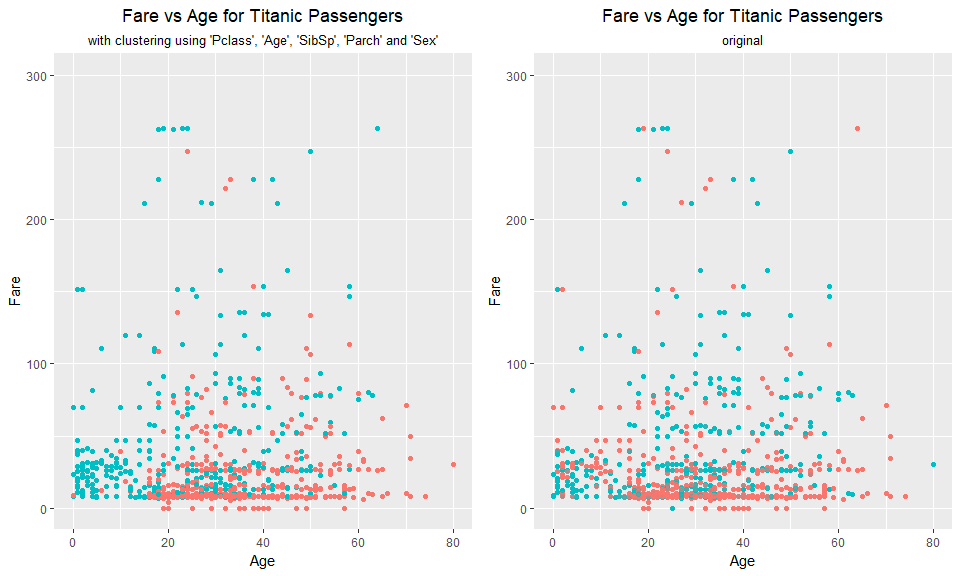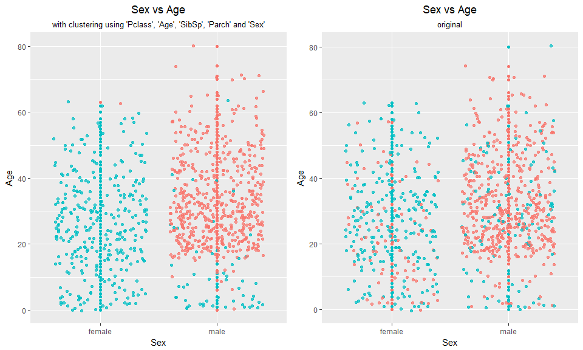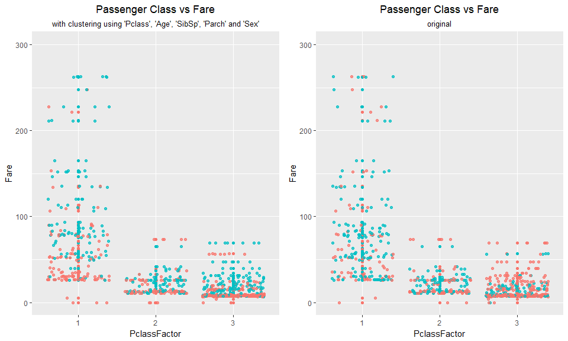

By looking at the multiple plots, we can see the fit is actually quite good. One thing it didn't tell was the low survival rate for passengers in Class 3, instead showing a good survival rate for those passengers. It seems like the clustering around the sex of passengers was prioritised very highly, as nearly all females survived in the clustered data.

This time, lets use the same attributes as before but drop only the "Sex" attribute and try the clustering again, to see if it is really *that* drastic in determining the survival of a passenger.

``` r
# perform a k-means clustering using "Pclass", "Age", "Sibsp", and "Parch" attributes
# with scaled values
# with 2 clusters and 20 iterations
titanicCluster3 = kmeans(scale(titanic.df[c(3,6,7,8)]), 2, nstart = 20, iter.max = 20)
```

Some information about the clustering:

``` r
titanicCluster3$size    # size of each cluster
```

    ## [1] 745 146

The size of the clusters is again slightly skewed towards one group, meaning many of the people predicted to not survive will have actually survived in reality. Again, we can't look at means for clusters as the data has been scaled.

``` r
# columns are survived/not survived, rows are the two clusters created
table(titanicCluster3$cluster, titanic.df$SurvivedFactor)
```

    ##    
    ##       0   1
    ##   1 474 271
    ##   2  75  71

A nearly even split of survivors and nonsurvivors in cluster 2... Not good for prediction.

Lets check the same plots as the previous clustering to see the effect of removing the sex attribute of the passengers. Again, red = not survived, blue = survived. Plots using clusters on the left, original data on the right:

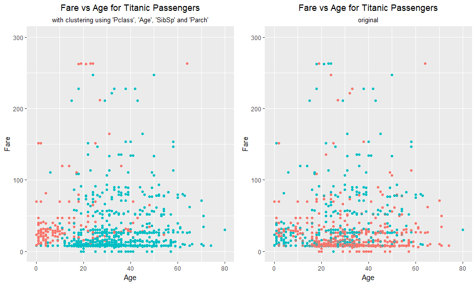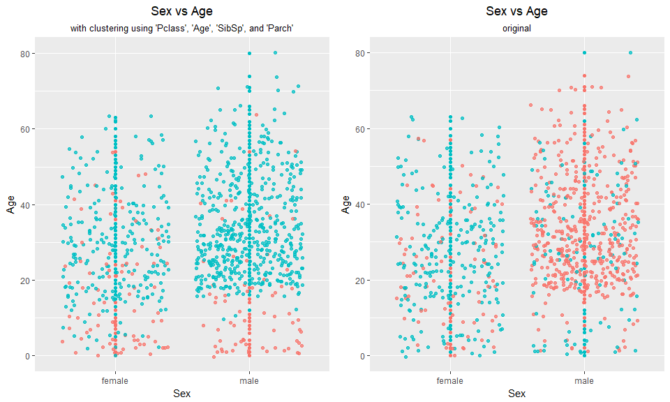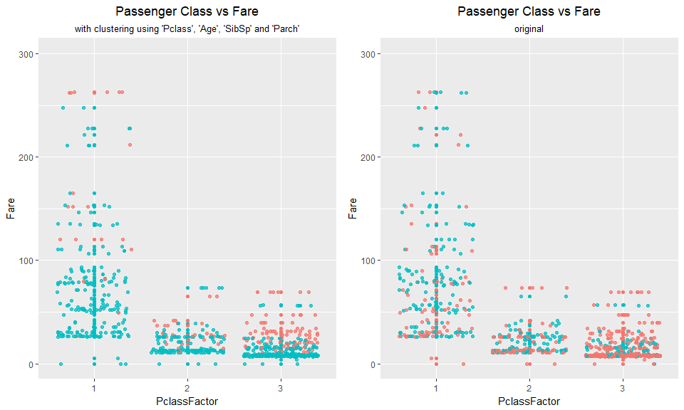

Without knowing the sex of a passenger, the k-means clustering algorithm believes a lot more passengers would have survived the Titanic accident. Looking at the male/female scatter plot, we can see no trend at all for survival rates between male and females.

In the end, it appears that the sex of passengers really is important for the k-means clustering algorithm to give a good determination of which passengers survive or not.

------------------------------------------------------------------------

Question 3
----------

``` r
set.seed(50) # sets a seed for random number generator
```

#### **a) Create a classification tree:**

Randomly select 125 survivors and 125 nonsurvivors for our training set:

``` r
# order the survivors (0 then 1)
ordered_titanic = titanic.df[order(titanic.df$Survived),] # our data set to be worked on
# we know there are 342 survivors, so 891-342=549 nonsurvivors
train = c(sample(1:549,125),sample(550:891,125)) # training subset of 250 passengers
```

Now, we can use rpart to create a tree, using only "Sex" as an independent attribute. Our dependent attribute is "Survived", as we want to predict this attribute for other data sets.

``` r
tree=rpart(SurvivedFactor~Sex,data=ordered_titanic,subset=train) # create tree
fancyRpartPlot(tree, sub = "Tree using only Sex as the independent variable") # display tree
```

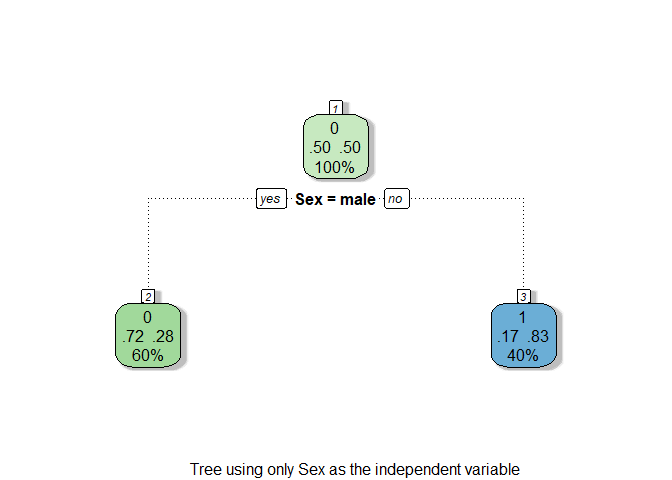

In the tree above, the uppermost number represents the dominant value for "Survived" attribute at that node, so 0 if there are more nonsurvivors than survivors at the current node and 1 for vice versa. The first node doesn't matter since it's a 50/50 split.

The middle numbers represent the proportion of dead/survived datapoints in a particular node (assuming the dependent attribute in the tree is "Survived")

The lowest number represents the percentage of datapoints at the current node vs the entire dataset the tree was built on.

#### **b) Predictions using the classification tree:**

Now we want to predict the "Survived" attribute of passengers NOT in the training subset (so use the dataframe minus the training subset for our test set).

``` r
# display prediction information in a table
# ordered_titanic[-train] returns rows in the ordered titanic dataset that is not indexed in the train vector, i.e. our test set
table(predict(tree,ordered_titanic[-train,],type="class"),ordered_titanic[-train,"Survived"])
```

    ##    
    ##       0   1
    ##   0 360  68
    ##   1  64 149

The predictions for the test set based on this particular tree is shown in a table form above.

The rows represent if the "Survived" attribute is 0 or 1, i.e. if the passenger in the test set were predicted to survived or not. The columns represent if that particular passenger actually survived (1) or not (0).

For this tree formed by only splitting males and females, 360/(360 + 68)=84.1% of nonsurvivors were predicted correctly, and 149/(149 + 64)=70.0% of survivors were predicted correctly, which is a decent performance for a tree with only one split.

#### **c) Create four additional classification trees:**

##### i. With "Pclass", "Age", "Sibsp" and "Parch" and "Sex"

We use the same training set as before, so we can create our tree using rpart straight away. At first lets try a lot of attributes to give us a general idea of what the tree looks like.

``` r
tree1 = rpart(SurvivedFactor~PclassFactor+Age+SibSp+Parch+Sex,data=ordered_titanic,subset=train) # create tree
fancyRpartPlot(tree1, sub = "Tree using PClass, Age, SibSp, Parch and Sex as the independent variables") # display tree
```

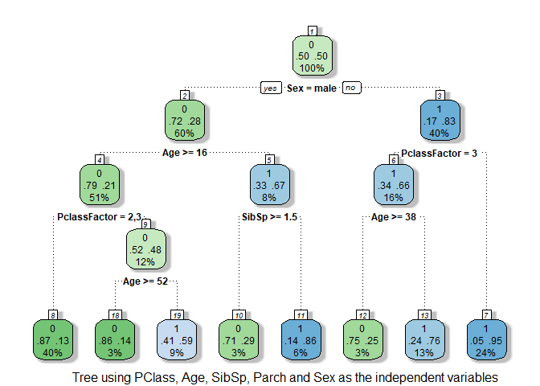

With the default settings, rpart has constructed a tree of depth four. It did not use the "Parch" attribute in the tree construction, which means including it would not improve the fit of the tree. This could mean that the number of children a parent had (or if a passenger had parents on board) was the smallest factor out of all five factors chosen to construct this tree. In the lowest level, we see many of the leaves of the tree have a very low percentage of the datapoints in the dataset. This could mean we have slightly overfitted.

##### ii. With "Pclass", "Age", "Sibsp" and "Parch"

What happens when we remove a strong factor of decision (the sex of a passenger)?

``` r
tree2 = rpart(SurvivedFactor~PclassFactor+Age+SibSp+Parch,data=ordered_titanic,subset=train) # create tree
fancyRpartPlot(tree2, sub = "Tree using PClass, Age, SibSp and Parch as the independent variables") # display tree
```

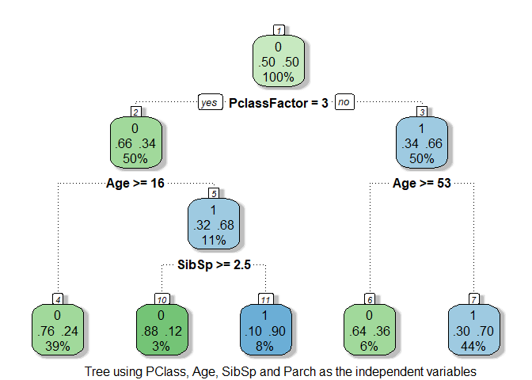

In question 1, on the plot of Passenger Class vs Fare, we noticed that though the fares for Pclass 2 and 3 were very similar, even having similar distributions, the rate of survival was much lower in Pclass 3 compared to Pclass 2. In the tree above, we notice that the first split is actually whether a passenger was in Class 3 or not, putting Class 1 and 2 on the same "side" of the tree. This could be further evidence to Class 3 having an unfortunate location with respect to the accident.

From this tree we can also see that for passengers under the age of 16 on Class 3, they still had a slightly higher rate of survival than the average rate of survival for passengers in Class 1 and 2, showing that children were prioritised first during the evacuation.

##### iii. With "Pclass" and "Embarked"

Let's try dive deeper into the Class 3 mystery, now constructing a classification tree using the passenger class and the port embarked from, to see if we get any more meaningful results.

``` r
tree3 = rpart(SurvivedFactor~PclassFactor+Embarked,data=ordered_titanic,subset=train) # create tree
fancyRpartPlot(tree3, sub = "Tree using PClass and Embarked as the independent variables") # display tree
```

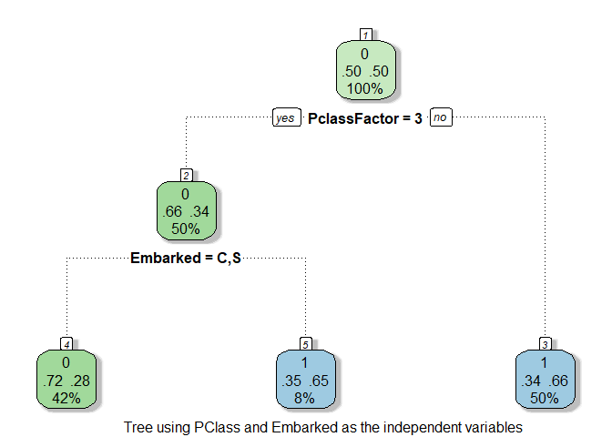

We see that for this training data, if you weren't in Class 3, your rate of survival is 66% off the bat. However, if you were in Class 3, and you embarked from port Q (Queenstown), you *also* had around the same percentage of surviving as if you weren't in Class 3, while passengers in Class 3 who embarked from C or S (Cherbourg and Southhampton) had only a 28% chance of surviving.

What's interesting is that if you look at a map of the Titanic's voyage where it sunk, you can see that it started at port S, then to port C and then to port Q (Queenstown was the last port of embarkation before heading to New York). Reference: <https://fi.wikipedia.org/wiki/Tiedosto:TitanicRoute.svg>

But people in Class 3 who boarded from Queenstown had a really high percentage of survival compared to those that embarked from the other two ports. Note that only 16% of Class 3 passengers embarked from Queenstown. This observation further strengthens the theory that the location of the Class 3 cabins mattered, and it seems like people who embarked from Southampton and Cherbourg got the "worse" cabins.

##### iv. With "Age" and "Fare"

``` r
tree4 = rpart(SurvivedFactor~Age+Fare,data=ordered_titanic,subset=train) # create tree
fancyRpartPlot(tree4, sub = "Tree using Age and Fare as the independent variables") # display tree
```

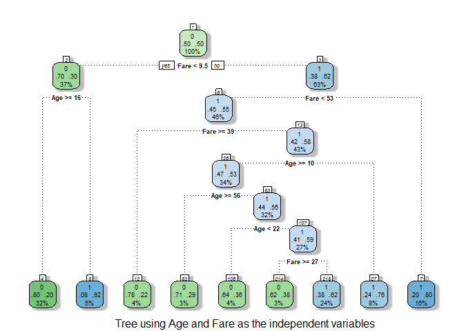

This tree definitely looks overfitted, but lets check the predictions later on anyway and see if we can change the stopping criteria to give a better fit to test data.

#### **d) Predictions using the previous classification trees:**

##### i. With "Pclass", "Age", "Sibsp" and "Parch" and "Sex"

``` r
# display prediction information in a table
table(predict(tree1,ordered_titanic[-train,],type="class"),ordered_titanic[-train,"Survived"])
```

    ##    
    ##       0   1
    ##   0 311  33
    ##   1 113 184

This tree predicts 311/(311 + 33)=90.4% of nonsurvivors correctly, and 184/(184 + 113)=62.0% of survivors correctly. While (compared to the first tree in part a)) this tree predicted a higher percentage of nonsurvivors correctly, it actually performed worse than the first tree with only one split for predicting survivors. This means we potentially overfitted the tree, meaning it is too specific to our training data, and performs worse on unseen test data.

We could try pruning this tree by 1 layer to see if it performs better:

``` r
tree1Pruned = prune.rpart(tree1,cp=0.024)
fancyRpartPlot(tree1Pruned, sub="Tree 1 pruned by 1 layer")
```

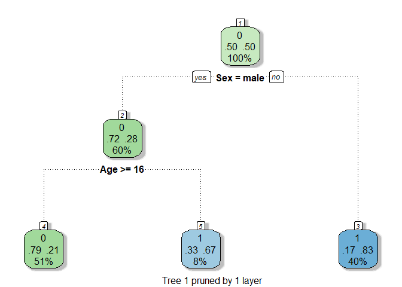

``` r
table(predict(tree1Pruned,ordered_titanic[-train,],type="class"),ordered_titanic[-train,"Survived"])
```

    ##    
    ##       0   1
    ##   0 335  58
    ##   1  89 159

The percentage accuracy for both survivor and nonsurvivor predictions does not increase by much so let's leave this tree alone.

##### ii. With "Pclass", "Age", "Sibsp" and "Parch"

``` r
# display prediction information in a table
table(predict(tree2,ordered_titanic[-train,],type="class"),ordered_titanic[-train,"Survived"])
```

    ##    
    ##       0   1
    ##   0 289  60
    ##   1 135 157

This tree predicts 289/(289 + 60)=82.8% of nonsurvivors correctly, and 157/(157 + 135)=53.8% of survivors correctly. The performance of this tree has dropped after removing the (arguably) most important attribute of the datapoints, the sex of the passenger. This tells us that we should definitely keep the sex attribute for future tree constructions for this dataset, if we want accurate predictions.

##### iii. With "Pclass" and "Embarked"

``` r
# display prediction information in a table
table(predict(tree3,ordered_titanic[-train,],type="class"),ordered_titanic[-train,"Survived"])
```

    ##    
    ##       0   1
    ##   0 251  62
    ##   1 173 155

This tree predicts 251/(251 + 62)=80.2% of nonsurvivors correctly, and 155/(155 + 173)=47.3% of survivors correctly. So even though there are some interesting observations we can draw from looking at this tree, in reality it is not really a good way to accurately determine the survival of someone outside the training set. These low percentage accuracies also remove significance of our observations. We could try to construct the same tree again with larger training dataset and see if it is more accurate, but for our current training set it is not good for prediction.

##### iv. With "Age" and "Fare"

``` r
# display prediction information in a table
table(predict(tree4,ordered_titanic[-train,],type="class"),ordered_titanic[-train,"Survived"])
```

    ##    
    ##       0   1
    ##   0 272  76
    ##   1 152 141

This tree predicts 272/(272 + 76)=78.2% of nonsurvivors correctly, and 141/(141 + 152)=48.1% of survivors correctly, which is not very strong. As said before, this could be due to a result of overfitting, so lets try and refit the tree with stopping criteria of a depth of 3.

``` r
tree4_1 = rpart(SurvivedFactor~Age+Fare,data=ordered_titanic,subset=train, control =  rpart.control(maxdepth = 3)) # create tree
fancyRpartPlot(tree4_1, sub = "Tree using Age and Fare as the independent variables, max depth of 3") # display tree
```

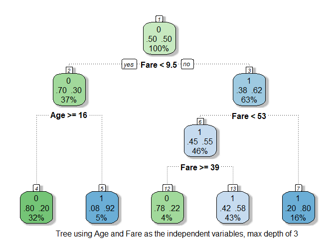

Again, we can see children under the age of 16 were of high priority for evacuation. However, we can also see a strange thing happening from node 6 to node 12 and 13: if your fare was less than $53, you had a 55% chance of survival, but if your fare was in between $39 and $53, the rate of survival was only 22%, while if your fare was less than $39 your rate of survival was 58%. This could just be due to the random nature of sampling so in order to be confident about our trees (any of them) for prediction we should try to sample more and maybe do cross validations.

``` r
# display prediction information in a table
table(predict(tree4_1,ordered_titanic[-train,],type="class"),ordered_titanic[-train,"Survived"])
```

    ##    
    ##       0   1
    ##   0 206  37
    ##   1 218 180

The new tree predicts 206/(206 + 37)=84.8% of nonsurvivors correctly, and 180/(180 + 218)=45.2% of survivors correctly, which is still not great for prediction. One conclusion we can draw from this is that for a given passenger in a test set, the age and fare paid by that passenger is not enough information in determining whether or not they would have survived the titanic incident or not.

------------------------------------------------------------------------

Overall, I think the best tree would definitely include the attributes "Age" "Pclass", "Sex", "Embarked" and "SibSp", as they seem to be the ones with the most clear cut results.

In general, if we want to make a good classification tree, we should train with lots of data and cross validate our training sets to give more accurate predictions for unseen data in test sets.
